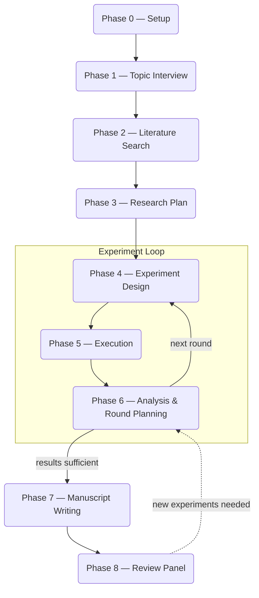

[한국어](README_ko.md)

> 🔗 **Threads에서 오셨나요?** 설치 없이 Claude 채팅에 복붙해서 쓰는 [스레드용 간이 프롬프트](스레드용_간이_프롬프트.md)를 확인하세요.

<p align="center">
  
</p>

<h1 align="center">Rev2Agent</h1>
<p align="center"><b>Reviewer 2 is now your agent.</b></p>

<p align="center">
<i>All those major revisions you've suffered through? Now you can send one back.</i><br>
<i>Experiments bombed? Stuck on framing? Just type <code>major revision</code>.</i>
</p>

---

Rev2Agent takes a vague research idea and iterates through literature search, experiment design, execution, analysis, and manuscript writing until you have a paper draft.

It runs as a set of markdown instructions for coding agents. Today the repository supports both [Claude Code](https://docs.anthropic.com/en/docs/claude-code) and Codex via separate root entrypoints: `CLAUDE.md` for Claude Code and `AGENTS.md` for Codex. No framework, no build step -- clone the repo, open it in your agent, and follow the appropriate startup protocol.

Both hosts load the same [agent workflow](prompts/agent_workflow.md) through short entrypoints. Research startup and state rules live in [conventions](prompts/conventions.md); phase prompts own scientific procedures. Model choice stays in host settings. See the [simplification comparison](docs/prompt-simplification.md) for instruction sizes, host-probe results, and remaining limits.

When you're stuck, type **`major revision`**. Rev2Agent convenes a discussion panel -- host-native review agents plus whichever external models you configured in Phase 0 (GPT, Gemini, Grok, etc.) -- to argue over your research decisions. The same kind of adversarial review you'd get from a venue, minus the six-month wait.

> *"Reviewer 2 acknowledges the author's ambition but questions whether the methodology section was written before or after the experiments were run."*

---

## What It Does

- Iterates from a vague idea to a manuscript draft through multiple experiment rounds
- Runs as markdown instructions only -- no framework, no build step; supports both Claude Code and Codex
- Tracks all research directions in a persistent roadmap -- nothing gets lost between rounds
- `major revision` convenes host-native reviewers plus external models to debate research decisions
- An independent reviewer cross-checks experiment logic before you spend GPU hours on it; code stays on-host by default
- Every manuscript claim is tagged as fact, synthesis, or common knowledge -- no vague "studies show..."
- Every BibTeX entry is verified against Crossref/DBLP/Semantic Scholar (LLMs fabricate ~30% of citations)
- 5 AI reviewers with distinct personas critique the final draft before you submit

## Phase Flow



Each project lives in its own directory with a `.research_state.json` file that tracks progress. Leave mid-session, come back days later -- the agent picks up exactly where it left off.

## Prerequisites

- **A supported coding agent host**
  - [Claude Code](https://docs.anthropic.com/en/docs/claude-code)
  - [Codex CLI](https://help.openai.com/en/articles/11096431-openai-codex-ci-getting-started)

### Optional enhancements

These are not required. Rev2Agent works without them, but each one improves a specific part of the pipeline.

**External LLM access** -- optional, for multi-model discussions

Set provider credentials as an environment variable before starting Rev2Agent, then give Phase 0 only the provider name. Do not paste credential values into chat. Supported references include `OPENROUTER_API_KEY`, `OPENAI_API_KEY`, `GEMINI_API_KEY`/`GOOGLE_API_KEY`, `XAI_API_KEY`, `ANTHROPIC_API_KEY`, and custom OpenAI-compatible providers.

External code review is disabled by default. Experiment logic is reviewed by a host-native adversarial reviewer unless you explicitly opt in after the code-egress disclosure. Enabling external discussion models does not enable source-code upload.

**Wrapper skills** -- shared prompts refer to host-neutral wrapper skill names, which each host maps to its own capabilities. Rev2Agent falls back gracefully if a host or skill is unavailable.

| Wrapper skill | Used in | Purpose | Claude Code mapping |
|--------------|---------|---------|---------------------|
| `research-deep-dive` | Phase 1-3 | Deep multi-source literature analysis | `/deep-research` |
| `code-quality-review` | Phase 5-6 | Code quality review after logical verification | `/simplify` |
| `writing-humanizer` | Phase 7 | Remove AI writing patterns from manuscript | `/humanizer` |

Under Codex, these wrapper names map through `AGENTS.md` to Codex-native workflows or manual fallback behavior.

**tectonic** -- for LaTeX manuscript compilation in Phase 7

```bash
curl --proto '=https' --tlsv1.2 -fsSL https://drop-sh.fullyjustified.net | sh
```

## Quick Start

See **[INSTALL.md](INSTALL.md)** for detailed setup instructions (English + 한국어).

For Claude Code, paste:

> Clone https://github.com/dalbom/rev2agent and set it up as my working directory. Then follow the CLAUDE.md startup protocol.

For Codex, open the repository and follow the `AGENTS.md` startup protocol.

That's it. Rev2Agent handles the rest.

## Special Commands

| Command | What it does |
|---------|-------------|
| <nobr>`major revision`</nobr> | Discussion panel (configured external models + host-native reviewers; external credentials come from environment references) |
| `reconfigure` | Re-run Phase 0 setup |

## The Reviewer 2 Persona

At phase transitions and result assessments, the agent speaks as Reviewer 2. It demands ablation studies, questions assumptions, and flags weak baselines -- so a human reviewer doesn't have to be the first one to catch them.

> *"Reviewer 2 finds the author's experimental design sound, but notes the absence of an ablation study. Major revisions."*

## How It Differs from Other Research Agents

| | Rev2Agent | Typical research agents |
|---|---|---|
| Architecture | Markdown prompts only, no framework | Custom frameworks or SDKs |
| Iteration | Multi-round with persistent roadmap | Single-pass or manual re-runs |
| Code verification | Independent adversarial review; host-native by default | None or linter-level |
| Citation integrity | Every reference web-verified | LLM-generated BibTeX (often wrong) |
| Manuscript safeguards | Fact/synthesis tagging, no vague attributions | No systematic checks |
| Review | 5-persona simulated peer review | None or single-pass |

## Project Structure

```
rev2agent/
├── AGENTS.md                    # Codex entrypoint
├── CLAUDE.md                    # Claude Code entrypoint
├── prompts/                     # Phase prompts (shared across hosts)
│   ├── conventions.md           # Shared state schema, enums, round rules
│   ├── 00_setup.md              # Phase 0: Environment setup
│   ├── 01_interview.md          # Phase 1: Topic interview
│   ├── 02_literature_search.md  # Phase 2: Literature search
│   ├── 03_research_plan.md      # Phase 3: Research plan
│   ├── 04_experiment_design.md  # Phase 4: Experiment design
│   ├── 05_experiment_execution.md # Phase 5: Experiment execution
│   ├── 06_result_analysis.md    # Phase 6: Result analysis
│   ├── 07_manuscript_writing.md # Phase 7: Manuscript writing
│   ├── 08_manuscript_review.md  # Phase 8: Review panel
│   └── compaction.md            # New-session-at-phase-boundary guidance
├── scripts/                     # Shared validation & analysis scripts
│   ├── verify_citations_bibtex.py  # BibTeX + Crossref/S2 verification
│   ├── collect_results.py          # Automated result table generation
│   ├── source_evaluator.py         # Literature source credibility scoring
│   └── validate_manuscript.py      # LaTeX cross-ref & placeholder checks
├── tests/                       # Test suite for the shared scripts
├── .github/                     # CI workflows
└── .gitignore
```

When you start a research project, the agent creates a project directory with this layout. Research projects live as **untracked subfolders** of the repository root -- they are not part of the framework's git history:

```
your_project/
├── .research_state.json         # Session state (single source of truth)
├── research_roadmap.md          # Persistent research directions
├── literature/                  # Paper summaries, BibTeX
├── experiment/                  # Scripts, results, logs, checkpoints
├── manuscript/                  # LaTeX source, figures, tables
└── summaries/                   # Phase and round documentation
```

### Your research data and git

Project subfolders are git-ignored by default (the `.gitignore` ignores every root-level directory that is not part of the framework), so your research data is never accidentally pushed to a public fork. If you want to version your research, initialize a separate git repository inside your project folder, or maintain your own fork with the ignore rule removed.

## Changelog

See [CHANGELOG.md](CHANGELOG.md) for release notes.

## License

[MIT](LICENSE)
