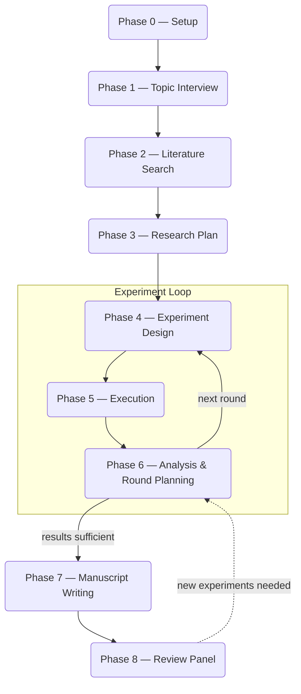

[한국어](README_ko.md)

<p align="center">
  
</p>

<h1 align="center">Rev2Agent</h1>
<p align="center"><b>Reviewer 2 is now your agent.</b></p>

<p align="center">
<i>All those major revisions you've suffered through? Now you can send one back.</i><br>
<i>Experiments bombed? Stuck on framing? Just type <code>major revision</code>.</i>
</p>

---

Rev2Agent takes a vague research idea and iterates through literature search, experiment design, execution, analysis, and manuscript writing until you have a paper draft.

It runs on [Claude Code](https://docs.anthropic.com/en/docs/claude-code) as a set of markdown prompts. No framework, no build step -- clone the repo, run `claude`, start talking about your research.

When you're stuck, type **`major revision`**. Rev2Agent convenes a discussion panel -- three Claude agents plus whichever external models you configured in Phase 0 (GPT, Gemini, Grok, etc.) -- to argue over your research decisions. The same kind of adversarial review you'd get from a venue, minus the six-month wait.

> *"Reviewer 2 acknowledges the author's ambition but questions whether the methodology section was written before or after the experiments were run."*

---

## What It Does

- Iterates from a vague idea to a manuscript draft through multiple experiment rounds
- Tracks all research directions in a persistent roadmap -- nothing gets lost between rounds
- `major revision` command convenes GPT, Gemini, and Claude to debate research decisions
- External model cross-checks experiment code logic before you spend GPU hours on it
- Every manuscript claim is tagged as fact, synthesis, or common knowledge -- no vague "studies show..."
- Every BibTeX entry is verified against DBLP/Semantic Scholar (LLMs fabricate ~30% of citations)
- 5 AI reviewers with distinct personas critique the final draft before you submit

## Phase Flow



Each project lives in its own directory with a `.research_state.json` file that tracks progress. Leave mid-session, come back days later -- the agent picks up exactly where it left off.

## Prerequisites

- **[Claude Code](https://docs.anthropic.com/en/docs/claude-code)** -- the only hard requirement

### Optional enhancements

These are not required. Rev2Agent works without them, but each one improves a specific part of the pipeline.

**External LLM API keys** -- for multi-model discussions and independent code verification

Paste your keys during Phase 0 setup. Rev2Agent auto-detects the provider from the key prefix. Supported providers include OpenRouter, Google AI Studio, OpenAI, xAI, and any OpenAI-compatible endpoint.

**Claude Code skills** -- Rev2Agent uses these if installed, falls back gracefully if not

| Skill | Used in | What it does | Install |
|-------|---------|-------------|---------|
| `/deep-research` | Phase 1-3 | Deep multi-source literature analysis | Built into Claude Code (Pro/Team/Enterprise) |
| `/simplify` | Phase 5-6 | Code quality review | Built into Claude Code |
| `/humanizer` | Phase 7 | Remove AI writing patterns from manuscript | `claude install-skill https://github.com/anthropics/claude-code-skills/tree/main/humanizer` |

**tectonic** -- for LaTeX manuscript compilation in Phase 7

```bash
curl --proto '=https' --tlsv1.2 -fsSL https://drop-sh.fullyjustified.net | sh
```

## Quick Start

```bash
git clone https://github.com/dalbom/rev2agent.git
cd rev2agent
claude
```

That's it. Claude Code reads `CLAUDE.md` automatically and begins Phase 0 (setup) on first run.

## Special Commands

| Command | What it does |
|---------|-------------|
| <nobr>`major revision`</nobr> | Multi-model discussion panel (external models + Claude, requires API keys from Phase 0) |
| `reconfigure` | Re-run Phase 0 setup |

## The Reviewer 2 Persona

At phase transitions and result assessments, the agent speaks as Reviewer 2. It demands ablation studies, questions assumptions, and flags weak baselines -- so a human reviewer doesn't have to be the first one to catch them.

> *"Reviewer 2 finds the author's experimental design sound, but notes the absence of an ablation study. Major revisions."*

## How It Differs from Other Research Agents

| | Rev2Agent | Typical research agents |
|---|---|---|
| Architecture | Markdown prompts only, no framework | Custom frameworks or SDKs |
| Iteration | Multi-round with persistent roadmap | Single-pass or manual re-runs |
| Code verification | External model cross-checks experiment logic | None or linter-level |
| Citation integrity | Every reference web-verified | LLM-generated BibTeX (often wrong) |
| Manuscript safeguards | Fact/synthesis tagging, no vague attributions | No systematic checks |
| Review | 5-persona simulated peer review | None or single-pass |

## Project Structure

```
rev2agent/
├── CLAUDE.md                    # Main agent instructions
├── prompts/
│   ├── 00_setup.md              # Phase 0: Environment setup
│   ├── 01_interview.md          # Phase 1: Topic interview
│   ├── 02_literature_search.md  # Phase 2: Literature search
│   ├── 03_research_plan.md      # Phase 3: Research plan
│   ├── 04_experiment_design.md  # Phase 4: Experiment design
│   ├── 05_experiment_execution.md # Phase 5: Experiment execution
│   ├── 06_result_analysis.md    # Phase 6: Result analysis
│   ├── 07_manuscript_writing.md # Phase 7: Manuscript writing
│   └── 08_manuscript_review.md  # Phase 8: Review panel
├── scripts/                     # Shared validation scripts
└── .gitignore
```

When you start a research project, the agent creates a project directory with this layout:

```
your_project/
├── .research_state.json         # Session state (single source of truth)
├── research_roadmap.md          # Persistent research directions
├── literature/                  # Paper summaries, BibTeX
├── experiment/                  # Scripts, results, logs, checkpoints
├── manuscript/                  # LaTeX source, figures, tables
└── summaries/                   # Phase and round documentation
```

## License

[MIT](LICENSE)
