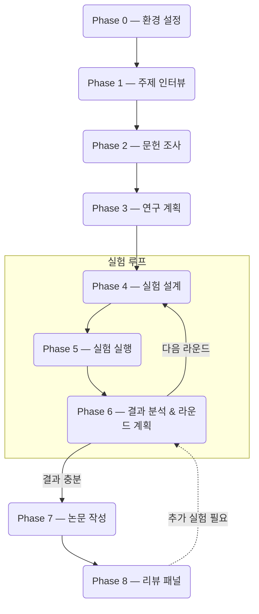

[English](README.md)

> 🔗 **Threads에서 오셨나요?** 설치 없이 Claude 채팅에 복붙해서 쓰는 [스레드용 간이 프롬프트](스레드용_간이_프롬프트.md)를 확인하세요.

<p align="center">
  
</p>

<h1 align="center">Rev2Agent</h1>
<p align="center"><b>Reviewer 2가 당신의 에이전트가 되었습니다.</b></p>

<p align="center">
<i>그동안 받기만 했던 major revision, 이제 rev2agent에게 날리세요.</i><br>
<i>실험 결과가 안 좋다? 방향이 막혔다? 그냥 <code>major revision</code>만 치세요.</i>
</p>

---

연구 아이디어 하나를 던지면 문헌 조사, 실험 설계, 실행, 분석, 논문 작성을 반복하면서 논문 초고까지 만들어주는 연구 에이전트입니다.

이 저장소는 코딩 에이전트를 위한 마크다운 지시문 세트로 동작합니다. 현재는 `CLAUDE.md`를 사용하는 Claude Code와 `AGENTS.md`를 사용하는 Codex를 모두 지원합니다. 프레임워크나 빌드 과정은 없습니다. 저장소를 열고, 현재 호스트에 맞는 시작 프로토콜만 따르면 됩니다.

학회에서 제일 까다롭다는 **Reviewer 2** 역할을 합니다. 실험 설계에 빈 곳이 있으면 짚고, ablation이 없으면 지적하고, 근거 없는 주장은 통과시키지 않습니다. 진짜 리뷰어한테 지적당하기 전에 먼저 잡아주는 겁니다.

막혔을 때 **`major revision`** 한 줄 치면 호스트의 기본 리뷰 에이전트들과 Phase 0에서 설정한 외부 모델(GPT, Gemini, Grok 등)이 패널로 붙어서 연구 방향을 놓고 토론합니다. 학회 리뷰 6개월 기다릴 거 없이.

## 주요 기능

- 아이디어에서 논문 초고까지, 실험을 여러 라운드 반복하면서 도달
- 마크다운 지시문만으로 동작. 프레임워크 없음. Claude Code와 Codex 모두 지원
- 모든 연구 방향을 로드맵에 기록. 라운드가 넘어가도 아이디어가 사라지지 않음
- `major revision` 명령으로 환경 변수로 연결된 외부 모델 + 호스트 기본 리뷰 에이전트가 함께 연구 방향 토론
- 실험 코드를 실행하기 전에 독립적인 검토자가 로직을 검증하며, 기본 설정에서는 코드가 호스트 밖으로 나가지 않음
- 원고의 모든 주장을 fact / synthesis / 상식으로 태깅. "연구에 따르면..." 같은 출처 없는 표현 금지
- BibTeX 엔트리를 Crossref/DBLP/Semantic Scholar에서 대조 (LLM은 인용의 ~30%를 지어냄)
- 5명의 AI 리뷰어가 각자 다른 관점에서 최종 원고를 심사

## 파이프라인 흐름



각 프로젝트는 진행 상황을 추적하는 `.research_state.json` 파일과 함께 자체 디렉토리에 저장됩니다. 세션 중간에 떠났다가 며칠 뒤에 돌아와도 에이전트가 정확히 멈춘 지점부터 다시 시작합니다.

## 필요 사항

- **지원되는 코딩 에이전트 호스트**
  - [Claude Code](https://docs.anthropic.com/en/docs/claude-code)
  - [Codex CLI](https://help.openai.com/en/articles/11096431-openai-codex-ci-getting-started)

### 선택 사항

없어도 동작하지만, 있으면 파이프라인 특정 단계가 개선됩니다.

**외부 LLM 연결** -- 멀티 모델 토론을 위한 선택 기능

Rev2Agent를 시작하기 전에 자격 증명을 환경 변수로 설정하고, Phase 0에는 프로바이더 이름만 알려 주세요. 비밀 값은 채팅에 입력하지 않습니다. `OPENROUTER_API_KEY`, `OPENAI_API_KEY`, `GEMINI_API_KEY`/`GOOGLE_API_KEY`, `XAI_API_KEY`, `ANTHROPIC_API_KEY` 및 사용자 지정 OpenAI-compatible 프로바이더를 지원합니다.

외부 코드 검토는 기본적으로 비활성화됩니다. 별도의 코드 반출 고지 후 명시적으로 동의하지 않는 한, 실험 로직은 호스트 내부의 적대적 검토 에이전트가 확인합니다. 외부 토론 모델 설정은 소스 코드 업로드 권한이 아닙니다.

**래퍼 skill 이름** -- 공유 프롬프트는 호스트 중립적인 skill 이름을 사용하고, 각 호스트가 이를 자기 기능으로 매핑합니다. 없으면 수동으로 대체합니다.

| 래퍼 skill | 사용 단계 | 기능 | Claude Code 매핑 |
|------------|-----------|------|-------------------|
| `research-deep-dive` | Phase 1-3 | 멀티 소스 문헌 심층 분석 | `/deep-research` |
| `code-quality-review` | Phase 5-6 | 논리 검증 후 코드 품질 리뷰 | `/simplify` |
| `writing-humanizer` | Phase 7 | 논문에서 AI 작성 패턴 제거 | `/humanizer` |

Codex에서는 이 래퍼 이름들이 `AGENTS.md`를 통해 Codex 쪽 워크플로 또는 수동 대체 절차로 매핑됩니다.

**tectonic** -- Phase 7에서 LaTeX 논문 PDF 컴파일에 사용

```bash
curl --proto '=https' --tlsv1.2 -fsSL https://drop-sh.fullyjustified.net | sh
```

## 빠른 시작

자세한 설치 방법은 **[INSTALL.md](INSTALL.md)**를 참고하세요.

Claude Code에서는 아래 프롬프트를 붙여넣으세요:

> Clone https://github.com/dalbom/rev2agent and set it up as my working directory. Then follow the CLAUDE.md startup protocol.

Codex에서는 저장소를 열고 `AGENTS.md` 시작 프로토콜을 따르면 됩니다.

나머지는 Rev2Agent가 안내합니다.

## 특수 명령어

| 명령어 | 설명 |
|--------|------|
| <nobr>`major revision`</nobr> | 토론 패널 소집 (환경 변수로 연결된 외부 모델 + 호스트 기본 리뷰 에이전트) |
| `reconfigure` | 환경 설정 다시 실행 |

## Reviewer 2 페르소나

Phase 전환이나 결과 평가 시점에 Reviewer 2로서 말합니다.

> Reviewer 2는 저자의 실험 설계가 건전하다고 판단하나, ablation study의 부재를 지적합니다.

> Reviewer 2는 Table 3의 결과가 baseline 대비 통계적으로 유의한지 의문을 제기합니다.

이 페르소나 덕분에 ablation 누락이나 약한 baseline 같은 문제를 실제 리뷰 전에 잡아냅니다.

## 기존 연구 에이전트와의 차이점

| | Rev2Agent | 일반적인 연구 에이전트 |
|---|---|---|
| 구현 방식 | 마크다운 프롬프트만, 프레임워크 없음 | 전용 프레임워크 또는 SDK |
| 실험 반복 | 영속 로드맵 기반 멀티 라운드 | single-pass 또는 수동 재실행 |
| 코드 검증 | 독립적인 적대적 검토, 기본값은 호스트 내부 | 없거나 린터 수준 |
| 인용 무결성 | 모든 레퍼런스를 웹에서 검증 | LLM이 생성한 BibTeX (자주 틀림) |
| 원고 안전장치 | fact/synthesis 태깅, 출처 없는 표현 금지 | 체계적 검증 없음 |
| 리뷰 | 5인 페르소나 모의 피어리뷰 | 없거나 single-pass |

## 프로젝트 구조

```
rev2agent/
├── AGENTS.md                    # Codex용 엔트리포인트
├── CLAUDE.md                    # Claude Code용 엔트리포인트
├── prompts/                     # 페이즈별 프롬프트 (호스트 간 공유)
│   ├── conventions.md           # 공유 상태 스키마, enum, 라운드 규칙
│   ├── 00_setup.md              # Phase 0: 환경 설정
│   ├── 01_interview.md          # Phase 1: 주제 인터뷰
│   ├── 02_literature_search.md  # Phase 2: 문헌 조사
│   ├── 03_research_plan.md      # Phase 3: 연구 계획
│   ├── 04_experiment_design.md  # Phase 4: 실험 설계
│   ├── 05_experiment_execution.md # Phase 5: 실험 실행
│   ├── 06_result_analysis.md    # Phase 6: 결과 분석
│   ├── 07_manuscript_writing.md # Phase 7: 논문 작성
│   ├── 08_manuscript_review.md  # Phase 8: 리뷰 패널
│   └── compaction.md            # 페이즈 경계 새 세션 가이드
├── scripts/                     # 공유 검증/분석 스크립트
│   ├── verify_citations_bibtex.py  # BibTeX + Crossref/S2 교차 검증
│   ├── collect_results.py          # 실험 결과 테이블 자동 생성
│   ├── source_evaluator.py         # 문헌 소스 신뢰도 평가
│   └── validate_manuscript.py      # LaTeX 교차참조/플레이스홀더 검증
├── tests/                       # 공유 스크립트 테스트 스위트
├── .github/                     # CI 워크플로
└── .gitignore
```

연구 프로젝트를 시작하면 에이전트가 아래 구조의 프로젝트 디렉토리를 만듭니다. 연구 프로젝트는 저장소 루트의 **untracked 하위 폴더**로 존재하며, 프레임워크의 git 히스토리에 포함되지 않습니다:

```
your_project/
├── .research_state.json         # 세션 상태 (단일 진실 공급원)
├── research_roadmap.md          # 영속 연구 방향 기록
├── literature/                  # 논문 요약, BibTeX
├── experiment/                  # 스크립트, 결과, 로그, 체크포인트
├── manuscript/                  # LaTeX 소스, 그림, 표
└── summaries/                   # 페이즈/라운드 문서
```

### 연구 데이터와 git

프로젝트 하위 폴더는 기본적으로 git에서 무시됩니다(`.gitignore`가 프레임워크 소속이 아닌 모든 루트 레벨 디렉토리를 무시). 따라서 연구 데이터가 실수로 public fork에 push되는 일은 없습니다. 연구 데이터를 버전 관리하고 싶다면 프로젝트 폴더 안에 별도의 git 저장소를 만들거나, ignore 규칙을 제거한 자신만의 fork를 유지하세요.

## 변경 이력

[CHANGELOG.md](CHANGELOG.md)에서 확인할 수 있습니다.

## 라이센스

[MIT](LICENSE)
