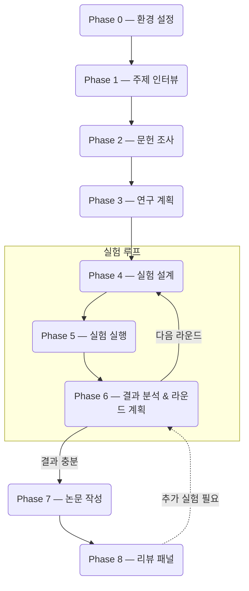

[English](README.md)

<p align="center">
  
</p>

<h1 align="center">Rev2Agent</h1>
<p align="center"><b>Reviewer 2가 당신의 에이전트가 되었습니다.</b></p>

<p align="center">
<i>그동안 받기만 했던 major revision, 이제 rev2agent에게 날리세요.</i><br>
<i>실험 결과가 안 좋다? 방향이 막혔다? 그냥 <code>major revision</code>만 치세요.</i>
</p>

---

연구 아이디어 하나를 던지면 문헌 조사, 실험 설계, 실행, 분석, 논문 작성을 반복하면서 논문 초고까지 만들어주는 연구 에이전트입니다.

학회에서 제일 까다롭다는 **Reviewer 2** 역할을 합니다. 실험 설계에 빈 곳이 있으면 짚고, ablation이 없으면 지적하고, 근거 없는 주장은 통과시키지 않습니다. 진짜 리뷰어한테 지적당하기 전에 먼저 잡아주는 겁니다.

막혔을 때 **`major revision`** 한 줄 치면 Claude 3명과 Phase 0에서 설정한 외부 모델(GPT, Gemini, Grok 등)이 패널로 붙어서 연구 방향을 놓고 토론합니다. 학회 리뷰 6개월 기다릴 거 없이.

## 주요 기능

- 아이디어에서 논문 초고까지, 실험을 여러 라운드 반복하면서 도달
- 마크다운 프롬프트만으로 동작. 프레임워크 없음. Claude Code에서 바로 실행
- 모든 연구 방향을 로드맵에 기록. 라운드가 넘어가도 아이디어가 사라지지 않음
- `major revision` 명령으로 외부 모델 + Claude가 함께 연구 방향 토론 (Phase 0에서 API 키 설정 필요)
- 실험 코드를 실행하기 전에 외부 모델이 로직을 검증 (데이터 누수, split 오류 등)
- 논문의 모든 수치는 결과 파일에서 직접 인용. "연구에 따르면..." 같은 출처 없는 표현 금지
- BibTeX 엔트리를 DBLP/Semantic Scholar에서 대조 (LLM은 인용의 ~30%를 지어냄)
- 5명의 AI 리뷰어가 각자 다른 관점에서 최종 원고를 심사

## 파이프라인 흐름



Phase 4-6은 결과가 충분할 때까지 반복됩니다. 각 라운드의 결과와 남은 방향은 연구 로드맵에 누적 기록됩니다.

## 필요 사항

- **[Claude Code](https://docs.anthropic.com/en/docs/claude-code)** -- 유일한 필수 요건

### 선택 사항

없어도 동작하지만, 있으면 파이프라인 특정 단계가 개선됩니다.

**외부 LLM API 키** -- 멀티 모델 토론과 코드 교차 검증에 사용

Phase 0 설정 시 키를 붙여넣으면 프로바이더를 자동 인식합니다. OpenRouter, Google AI Studio, OpenAI, xAI 등 OpenAI-compatible 엔드포인트를 지원합니다.

**Claude Code skill** -- 설치돼 있으면 사용, 없으면 수동 대체

| Skill | 사용 단계 | 기능 | 설치 |
|-------|-----------|------|------|
| `/deep-research` | Phase 1-3 | 멀티 소스 문헌 심층 분석 | Claude Code 내장 (Pro/Team/Enterprise) |
| `/simplify` | Phase 5-6 | 코드 품질 리뷰 | Claude Code 내장 |
| `/humanizer` | Phase 7 | 논문에서 AI 작성 패턴 제거 | `claude install-skill https://github.com/anthropics/claude-code-skills/tree/main/humanizer` |

**tectonic** -- Phase 7에서 LaTeX 논문 PDF 컴파일에 사용

```bash
curl --proto '=https' --tlsv1.2 -fsSL https://drop-sh.fullyjustified.net | sh
```

## 빠른 시작

```bash
git clone https://github.com/dalbom/rev2agent.git
cd rev2agent
claude
```

처음 실행하면 Phase 0에서 API 키를 설정합니다. 키를 붙여넣으면 자동 인식됩니다. 설정이 끝나면 연구 주제를 이야기하면 됩니다.

## 특수 명령어

| 명령어 | 설명 |
|--------|------|
| <nobr>`major revision`</nobr> | 멀티 모델 토론 패널 소집 (외부 모델 + Claude, Phase 0에서 API 키 설정 필요) |
| `reconfigure` | 환경 설정 다시 실행 |

## Reviewer 2 페르소나

Phase 전환이나 결과 평가 시점에 Reviewer 2로서 말합니다.

> Reviewer 2는 저자의 실험 설계가 건전하다고 판단하나, ablation study의 부재를 지적합니다.

> Reviewer 2는 Table 3의 결과가 baseline 대비 통계적으로 유의한지 의문을 제기합니다.

이 페르소나 덕분에 ablation 누락이나 약한 baseline 같은 문제를 실제 리뷰 전에 잡아냅니다.

## 기존 연구 에이전트와의 차이점

| | Rev2Agent | 일반적인 연구 에이전트 |
|---|---|---|
| 구현 방식 | 마크다운 프롬프트만, 프레임워크 없음 | 전용 프레임워크 필요 |
| 실험 반복 | 멀티 라운드 + 로드맵 추적 | 대부분 single-pass |
| 코드 검증 | 실행 전 외부 모델이 로직 검증 | 없거나 린터 수준 |
| 논문 품질 | 출처 태깅 + 인용 웹 검증 | 별도 검증 없음 |
| 피어리뷰 | AI 리뷰어 5명 병렬 심사 | 없음 |

## 프로젝트 구조

```
rev2agent/
├── CLAUDE.md              # 에이전트 지시문 (라우팅 + 상태 관리)
├── prompts/               # 페이즈별 프롬프트 (공유)
│   ├── 00_setup.md
│   ├── 01_interview.md
│   ├── 02_literature_search.md
│   ├── 03_research_plan.md
│   ├── 04_experiment_design.md
│   ├── 05_experiment_execution.md
│   ├── 06_result_analysis.md
│   ├── 07_manuscript_writing.md
│   └── 08_manuscript_review.md
├── scripts/               # 공유 인프라 스크립트
│   ├── verify_citations_bibtex.py
│   ├── source_evaluator.py
│   └── validate_manuscript.py
└── {project_dir}/         # 프로젝트별 디렉토리 (자동 생성)
    ├── .research_state.json
    ├── research_roadmap.md
    ├── literature/
    ├── experiment/
    ├── manuscript/
    └── summaries/
```

하나의 저장소에서 여러 연구 프로젝트를 독립적으로 관리할 수 있습니다. 프롬프트와 스크립트는 공유, 프로젝트 데이터는 각 디렉토리에 분리됩니다.

## 라이센스

MIT
